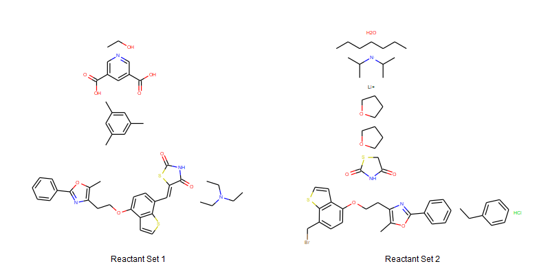
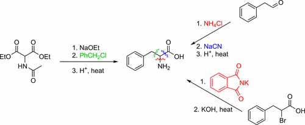

# Retrosynthesis Reaction Prediction with SMILES Augmentation

This repo details experiments on predicting retrosynthesis reactants from products using neural machine translation and SMILES based data augmentation.

## What is Retrosynthesis?

Organic synthesis is is the study of creating molecules through chemical reactions. Synthesis is often thought of as developing a pathway that will map some precursor compounds through a series of reactions to create a desired product. Good synthetic routes maximize speed, cost and yield while minimizing off target products. When an organic compound needs to be produced at scale, choosing the right synthetic route can have a major impact on the cost of production. Often, organic chemists find themselves in the position of planning reaction pathways out in reverse. Starting from the desired product molecule, how do we develop the most efficient synthesis pathway? This brings us to the problem of Retrosynthesis. Retrosynthesis is the process of taking some target molecule and working backwards iteratively to break the target molecule into simpler precursor molecules until all reactions start from a set of precursors that are cheap and widely available.

Retrosynthesis is hard. A major challenge is that the relationship between reactants and products has a many to one mapping. A specific target molecule can be made through multiple different synthetic routes. Consider the following product molecule:

This molecule can be generated using either of the following reactant sets:

In fact, every carbon to carbon bond in the product molecule is potentially a different synthetic route. For example:

[source](https://pubs.acs.org/doi/10.1021/acscentsci.7b00303)

How do you choose which one is better? We can determine the criteria easily - we want the reaction that maximizes speed, yield, specificity (lack of off target products) and cost. Actually quantifying these metrics is another matter. If there is no literature on the specific reaction, it falls to an expert organic chemist. The chemist must use their knowledge of reaction mechanisms to estimate off target products. Yield must be determined experimentally, which takes time.

This process must be conducted iteratively at all levels of pathway planning. It's time consuming and relies on domain experts and their ability to keep thousands of reaction mechanisms in mind at all steps. Because of the challenge of this process, many computational tools have been developed to aid retrosynthesis planning.

## Computational Retrosynthesis

The difficulty of the Retrosynthesis problem has lead to a number of computational tools designed to assist chemists in planning synthetic routes. One way of developing a retrosynthesis algorithm is to use symbolic logic and expert designed rules. Rules based algorithms use specific reation rules defined by expert chemists in conjunction with a large database of known reactions to make retrosynthesis predictions. The problem with these systems is they generalize very poorly outside their specific rule set. This restricts the usefulness of rules based algorithms to simple targets, which are not particularly useful. 

Other algorithms use physical chemistry calculations to predict reaction energy barriers and likely products from first principals. This class of algorithms generalize much better to novel molecules, but are computationally prohibitive.

More recently, machine learning algorithms have been combined with rules based algorithms to improve performance, but have not escaped the generalization drawbacks of rules based systems. This has motivated fully machine learning based solutions to retrosyntehsis prediction.
